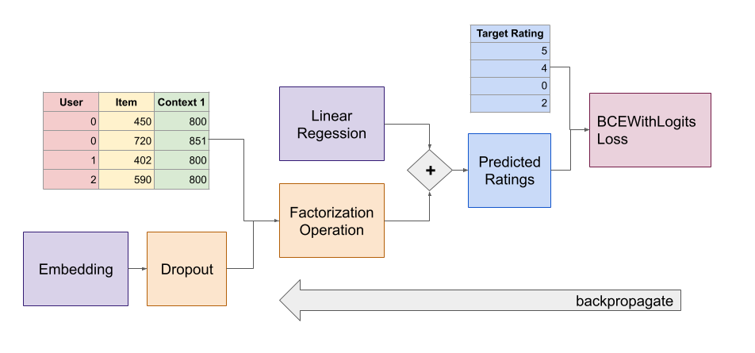
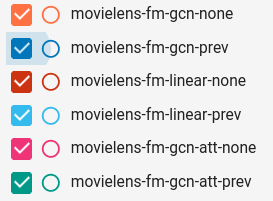

Recommendation System
====

Final Project for the UPC Artificial Intelligence with Deep Learning Postgraduate Course, Spring 2021.

* Authors: [Abel Martínez](mailto:abelmart@gmail.com), [Rafael Pérez](rrafaelapm93@gmail.com), [Miguel Ibero](mailto:miguel@ibero.me)
* Team Advisor: Paula Gomez Duran
* Date: July 2021


## Table of Contents 

TODO

# Introduction <a name="intro"></a>

The goal of this project is to develop a state-of-the art collaborative filtering recommender system using machine learning that can be trained on multiple datasets. Collaborative filtering is the method used by tech companies like Amazon and Netflix for their recommender systems as it can be trained without having user & item metadata.

Factorization machines were proposed in [this 2010 paper](https://www.csie.ntu.edu.tw/~b97053/paper/Rendle2010FM.pdf) as a way of doing matrix factorization that improves
on the classic single value decomposition models by being more optimized for sparse datasets and supporting additional interaction context, this is ideal for recommender systems. In addition to that, we also want to implement [this paper](https://arxiv.org/pdf/1609.02907.pdf) that proposes replacing the factorization machine embedding with a graph convolutional network.

# Overview <a name="overview"></a>

## Setup & Usage

The whole project is implemented as a command-line tool. We provide the following commands:

* `nnrecommend train` train a model on a dataset
* `nnrecommend fit` fit a dataset using [surprise](https://surpriselib.com/) algorithms
* `nnrecommend tune` tune model hyperparameters using [ray tune](https://docs.ray.io/en/master/tune/index.html)
* `nnrecommend explore-dataset` show information about a dataset
* `nnrecommend recommend` load a trained model to get recommendations

Please read the tool setup and usage instructions [in this separate file](./USAGE.md).

## Architecture <a name="architecture"></a>

### Model

Our model classes can be found in the `nnrecommend.model` namespace. The `FactorizationMachine` equation is split in two classes; `LinearFeatures` implements the linear regression part of the equation, wile `FactorizationMachineOperation` implements the square of sum minus sum of squares part. The embeddings can be of thre types, using the normal `torch.nn.Embedding` for linear embeddings, using `GraphEmbedding` which internally uses `torch_geometric.nn.GCNConv`, and using `GraphAttentionEmbedding` which internally uses `torch_geometric.nn.GATConv`. Over the embedding module we added a dropout to prevent the model from overfitting. 



We implemented the Binary Personalized Ranking loss
as explained in [this paper](https://arxiv.org/pdf/1205.2618.pdf) in the `BPRLoss` class.

### Dataset

`nnrecommend.dataset.InteractionDataset` is the main dataset class used in the tool. It takes care of dealing with
a two dimensional numpy array of interactions where every column is formed by consecutive ids. To guarantee its correct behavior, we wrote some unit tests for it that can be found in the `test_dataset.py` file.


The `InteractionPairDataset` class allows the system to train de model with `BPRLoss` by converting the dataset into pairs of positive and negative interactions.


The `GroupingDataset` class is used in the testset to make the trainloader (set with `batch=1`) return the interaction groups for the same user.

Since we want to be able to load different datasets, each one needs to implement `nnrecommend.dataset.BaseDatasetSource`,
this class will setup the basic dataset logic like removing low interactions, adding previous item context, etc...
This is currently implemented for the movielens, spotify & podcasts datasets. Every new dataset would need to load:

* `self.trainset`: the `InteractionDataset` with the data
* `self.items`: a pandas `DataFrame` containing item metadata (used in the recommender)

Each specific dataset source can call `BaseDatasetSource._setup` to use generic functionallity like removing interactions with users or items that have low counts or extracting the testset interactions.

### Operations

Since most of the commands have similar flows, we implemented them in reusable classes.

The `nnrecommend.operation.Setup` class takes the `nnrecommend.dataset.BaseDatasetSource` and configures the negative sampling based on the provided hyperparameters.

The `nnrecommend.operation.Trainer` class contains the core training logic, it supports both pairwise datasets and normal ones.

The `nnrecommend.operation.Tester` class is used to obtain the evaluation metrics from a model or algorithm. It supports the following:
* Hit Ratio (HR): Measures whether the real test item is in the top positions of the recommendation list
* Normalized Discounted Cumulative Gain (NDCG): Measures the ranking quality which gives information about where in the raking is our real test item.
* Coverage (COV): Measures the amount of total items in the topk positions.

The `nnrecommend.operation.RunTracker` class sends the training & testing metrics to tensorboard and could be extended to send them to other systems.

The `nnrecommend.operation.Finder` and `nnrecommend.operation.Recommender` classes are used in the `recommend` subcommand
to find items that match metadata and then ask the model for its recommendations.

### Hyperparameters

We created a `nnrecommend.hparams.HyperParameters` class that can load hyperparameters from the command line or from files.

# Experiments

## Movielens Evaluation

The movielens dataset consists of 100k interactions between 943 users and 1682 movies. We found [this 2019 paper](https://arxiv.org/pdf/1909.06627v1.pdf) that lists evaluation metrics for different recommender systems using this dataset.

| model | hit ratio | ndcg |
| -- | --- | --- |
| ItemKNN | 0.5891 | 0.3283 |
| NeuACF | 0.6846 | 0.4068 |
| NeuACF++ | 0.6915 | 0.4092 |

Our hypothesis is that we should be able to reproduce similar metrics and hopefully improve them using factorization machines with GCN.

Download the dataset from [this link](https://www.kaggle.com/prajitdatta/movielens-100k-dataset/) and place it under the `data/ml-100k` folder.

We run our models matching the hyperparameters specified in the paper to be able to compare them

| hparam | value |
| --- | --- |
| `embed_dim` | 64 |
| `negatives_train` | 10 |
| `negatives_test` | 99 |
| `topk` | 10 |

Initial evaluation running with `fm-linear` shows that we're already better than knn, but still not better than NeuACF or NeuACF++.

```bash
nnrecommend --hparams-file hparams/movielens/initial_hparams.json train data/ml-100k --dataset movielens --model fm-linear --tensorboard tensorboard
nnrecomment --hparams-file hparams/movielens/initial_hparams.json fit data/ml-100k --dataset movielens --algorithm knn --tensorboard tensorboard
```


 nabling `pairwise_loss` and adding previous item context we achieve better results.
We optimized the model parameters using the `nnrecommend tune` command.

```bash
nnrecommend -v tune data/ml-100k --dataset movielens --config hparams/movielens/tune_config.json --model fm-linear
nnrecommend -v tune data/ml-100k --dataset movielens --config hparams/movielens/tune_config.json --model fm-gcn 
```

```bash
nnrecommend --hparams-file hparams/movielens/linear_testset_hparams.json train data/ml-100k --dataset movielens --model fm-linear --tensorboard tensorboard
nnrecommend --hparams-file hparams/movielens/gcn_testset_hparams.json train data/ml-100k --dataset movielens --model fm-gcn --tensorboard tensorboard
nnrecommend --hparams-file hparams/movielens/gcn_testset_hparams.json train data/ml-100k --dataset movielens --model fm-gcn --tensorboard tensorboard
```

comparing fm-linear, fm-gcn and fm-gcn-att without context


comparing fm-linear, fm-gcn and fm-gcn-att with previous item context




We can observe that:
* adding previous item context improves the metrics
* GCN has better results than linear
* GCN with attention has better results than GCN in terms of coverage

| type | model | context | hit ratio | ndcg | coverage |
| --- | -- | --- | --- | --- | --- |
| paper | ItemKNN | | 0.5891 | 0.3283 |
| paper | NeuACF | | 0.6846 | 0.4068 | |
| paper | NeuACF++ | | 0.6915 | 0.4092 | |
| nnrecommend | fm-linear | | 0.6458 | 0.3658 | 0.5458 |
| nnrecommend | fm-linear | prev | 0.7264 | 0.4453 | 0.6046 |
| nnrecommend | fm-gcn | | 0.6543 | 0.3792 | 0.5856 |
| nnrecommend | fm-gcn | prev | 0.7370 | 0.4611 | 0.6165 |
| nnrecommend | fm-gcn-att | | 0.6596 | 0.3883 | 0.6225 |
| nnrecommend | fm-gcn-att | prev | 0.7349 | 0.4581 | 0.7206 |
| nnrecommend | knn |  | 0.5716 | 0.3422 | 0.8062 |

## Spotify Evaluation

Now that we see that our models improved the results of the paper in the movielens dataset, we will try them out on another dataset, spotify sessions and songs that were released for the sequential skip prediction challenge. The dataset can be downloaded from [here](https://www.aicrowd.com/challenges/spotify-sequential-skip-prediction-challenge).

Our hypothesis is that we can train our models on this data and obtain similar results to the movielens ones.
In addition to this, since the dataset includes a lot of metadata, we want to add other context rows and evaluate if those improve the metrics.

## Addressing The Cold Start Problem

We found that our models we're pretty good at predicting recommendations for existing users, but since this is a collaborative filtering recommender system, it suffers from the cold start problem, i.e. it cannot recommend items to users that are not in the dataset.

To solve this issue we propose a modification of the `InteractionDataset` that goes as follows:
* remove the `user` column
* compute previous item context column
* switch the item column with the previous item context column

With this change we have a dataset where given a previous item, the factorization machine should give a rating for the next item. Our hypothesis is that we can use this new dataset to train the same factorization machine to recommend an item to new users that only need to provide 1 item they like. This algorithm could be easily extended to add more previous item columns and be able to recommend an item by providing `n` previous items.

To evaluate this hypothesis we can use the same metrics as in the normal factorization machine, we will just group by previous item instead of by user. That said, to test the trained model and obtain some sample recommendations, it would be best to have dataset that contains item metadata. Therefore we will test with the movielens dataset, since the spotify one does not contain song names.

We found another [kaggle dataset](https://www.kaggle.com/thoughtvector/podcastreviews) that looked promising and included item metadata, information about itunes podcasts reviews.

# Conclusions

