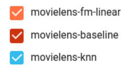

Recommendation System
====

Final Project for the UPC Artificial Intelligence with Deep Learning Postgraduate Course, Spring 2021.

* Authors: [Abel Martínez](mailto:abelmart@gmail.com), [Rafael Pérez](rrafaelapm93@gmail.com), [Miguel Ibero](mailto:miguel@ibero.me)
* Team Advisor: Paula Gomez Duran
* Date: July 2021


## Table of Contents 

TODO

# Introduction <a name="intro"></a>

The goal of this project is to implement a state-of-the art collaborative filtering recommender system using machine learning that can be trained on multiple datasets. Collaborative filtering is the method used by tech companies like Amazon and Netflix for their recommender systems as it can be trained without having user & item metadata.

Factorization machines were proposed in [this 2010 paper](https://www.csie.ntu.edu.tw/~b97053/paper/Rendle2010FM.pdf) as a way of doing matrix factorization that improves
on the classic single value decomposition models by being more optimized for sparse datasets and supporting additional interaction context, this is ideal for recommender systems. In addition to that, we also want to implement [this paper](https://arxiv.org/pdf/1609.02907.pdf) that proposes replacing the factorization machine embedding with a graph convolutional network.


# Overview <a name="overview"></a>

## Architecture <a name="architecture"></a>

### Model

Our model classes can be found in the `nnrecommend.model` namespace. The `FactorizationMachine` equation is split in two classes; `LinearFeatures` implements the linear regression part of the equation, wile `FactorizationMachineOperation` implements the square of sum minus sum of squares part. The embeddings can be of thre types, using the normal `torch.nn.Embedding` for linear embeddings, using `GraphEmbedding` which internally uses `torch_geometric.nn.GCNConv`, and using `GraphAttentionEmbedding` which internally uses `torch_geometric.nn.GATConv`.


We implemented the Binary Personalized Ranking loss
as explained in [this paper](https://arxiv.org/pdf/1205.2618.pdf) in the `BPRLoss` class.

### Dataset

`nnrecommend.dataset.InteractionDataset` is the main dataset class used in the tool. It takes care of dealing with
a two dimensional numpy array of interactions where every column is formed by consecutive ids.


Since we want to be able to load different datasets, each one needs to implement `nnrecommend.dataset.BaseDatasetSource`,
this class will setup the basic dataset logic like removing low interactions, adding previous item context, etc...

### Operations

The `nnrecommend.operation.Setup` class takes the `nnrecommend.dataset.BaseDatasetSource` and configures the negative sampling based on the provided hyperparameters.

## Usage

The tool consists of a set of commands implemented using the [click](https://click.palletsprojects.com/en/8.0.x/) library.
Please read the tool installation and usage instructions [here](./USAGE.md).

# Experiments

## Movielens Evaluation

The movielens dataset consists of 100k interactions between 943 users and 1682 movies. We found [this 2019 paper](https://arxiv.org/pdf/1909.06627v1.pdf) that lists evaluation metrics for different recommender systems using this dataset.

| model | hit ratio | ndcg |
| -- | --- | --- |
| ItemKNN | 0.5891 | 0.3283 |
| NeuACF | 0.6846 | 0.4068 |
| NeuACF++ | 0.6915 | 0.4092 |

Our hypothesis is that we should be able to reproduce similar metrics and hopefully improve them using factorization machines with GCN.

Download the dataset from [this link](https://www.kaggle.com/prajitdatta/movielens-100k-dataset/) and place it under the `data/ml-100k` folder.

We run our models matching the hyperparameters specified in the paper to be able to compare them

| hparam | value |
| --- | --- |
| `embed_dim` | 64 |
| `negatives_train` | 10 |
| `negatives_test` | 99 |
| `topk` | 10 |

Initial evaluation running with `fm-linear` shows that we're already better than knn, but still not better than NeuACF or NeuACF++.

```bash
nnrecommend --hparams-file hparams/movielens/initial_hparams.json train data/ml-100k --dataset movielens --model fm-linear --tensorboard tensorboard
nnrecomment --hparams-file hparams/movielens/initial_hparams.json fit data/ml-100k --dataset movielens --algorithm knn --tensorboard tensorboard
```





 nabling `pairwise_loss` and adding previous item context we achieve better results.
We optimized the model parameters using the `nnrecommend tune` command.

```bash
nnrecommend -v tune data/ml-100k --dataset movielens --config hparams/movielens/tune_config.json --model fm-linear
nnrecommend -v tune data/ml-100k --dataset movielens --config hparams/movielens/tune_config.json --model fm-gcn 
```

```bash
nnrecommend --hparams-file hparams/movielens/linear_testset_hparams.json train data/ml-100k --dataset movielens --model fm-linear --tensorboard tensorboard
nnrecommend --hparams-file hparams/movielens/gcn_testset_hparams.json train data/ml-100k --dataset movielens --model fm-gcn --tensorboard tensorboard
nnrecommend --hparams-file hparams/movielens/gcn_testset_hparams.json train data/ml-100k --dataset movielens --model fm-gcn --tensorboard tensorboard
```

comparing fm-linear, fm-gcn and fm-gcn-att without context


comparing fm-linear, fm-gcn and fm-gcn-att with previous item context


We can observe that:
* adding previous item context improves the metrics
* GCN has better results than linear
* GCN with attention has better results than GCN in terms of coverage

| type | model | context | hit ratio | ndcg | coverage |
| --- | -- | --- | --- | --- | --- |
| paper | ItemKNN | | 0.5891 | 0.3283 |
| paper | NeuACF | | 0.6846 | 0.4068 | |
| paper | NeuACF++ | | 0.6915 | 0.4092 | |
| nnrecommend | fm-linear | | 0.6458 | 0.3658 | 0.5458 |
| nnrecommend | fm-linear | prev | 0.7264 | 0.4453 | 0.6046 |
| nnrecommend | fm-gcn | | 0.6543 | 0.3792 | 0.5856 |
| nnrecommend | fm-gcn | prev | 0.7370 | 0.4611 | 0.6165 |
| nnrecommend | fm-gcn-att | | 0.6596 | 0.3883 | 0.6225 |
| nnrecommend | fm-gcn-att | prev | 0.7349 | 0.4581 | 0.7206 |
| nnrecommend | knn |  | 0.5716 | 0.3422 | 0.8062 |

## Spotify Evaluation

Now that we see that our models improved the results of the paper in the movielens dataset, we will try them out on another dataset, spotify sessions and songs that were released for the sequential skip prediction challenge. The dataset can be downloaded from [here](https://www.aicrowd.com/challenges/spotify-sequential-skip-prediction-challenge).

Our hypothesis is that we can train our models on this data and obtain similar results to the movielens ones.
In addition to this, since the dataset includes a lot of metadata, we want to add other context rows and evaluate if those improve the metrics.

## Itunes Podcasts

We found another kaggle dataset that looked promising, the itunes podcasts.

## Addressing The Cold Start Problem

# Conclusions

