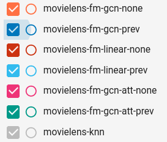

# Model Evaluation using the Movielens Dataset

We compared different models using the [movielens dataset](https://www.kaggle.com/prajitdatta/movielens-100k-dataset/). The tensorboard logdir can be downloaded from [here](./tensorboard.zip).

some conclusions for this dataset:
* adding the previous item as a context improves the metrics substantially
* using pairwise loss improves results with previous context
* gcn is not much better than linear

comparing all the nnrecommend training with rating loss

comparing all the nnrecommend training with pairwise loss

comparing fm-linear without context with previous movie context

### Evaluation

| type | model | context | loss | hit ratio | ndcg | coverage |
| --- | -- | --- | --- | --- | --- | --- |
| FM-Fairness | fm-linear |  | pairwise | 0.0901 | 0.0479 | 0.10
| FM-Fairness | fm-linear | prev | pairwise | 0.1389 | 0.0697 | 0.19 |
| FM-Fairness | fm-gcn |  | pairwise | 0.1050 | 0.0537 |  0.15 
| FM-Fairness | fm-gcn | prev | pairwise | 0.1389 | 0.0765 | 0.21 | 
| nnrecommend | fm-linear |  | rating | 0.1103 | 0.0557 | 0.1986 |
| nnrecommend | fm-linear | prev | rating | 0.1463 | 0.0735 | 0.2033 |
| nnrecommend | fm-linear |  | pairwise | 0.1018 | 0.0513 | 0.2021 |
| nnrecommend | fm-linear | prev | pairwise | 0.1622 | 0.0807 | 0.2206 |
| nnrecommend | fm-gcn |  | rating | 0.1007 | 0.0537 | 0.2075 |
| nnrecommend | fm-gcn | prev | rating | 0.1421 | 0.0700 | 0.1944 |
| nnrecommend | fm-gcn |  | pairwise | 0.1007 | 0.0510 | 0.2045 |
| nnrecommend | fm-gcn | prev | pairwise | 0.1506 | 0.0741 | 0.2253 |
| nnrecommend | knn |  |  | 0.0891 | 0.0474 | 0.1795

### Hyperparameters

| name | value |
| --- | --- |
| negatives_train | 4 |
| negatives_test | -1 |
| batch_size | 1024 |
| epochs | 20 |
| embed_dim | 64 |
| learning_rate | 0.001 |
| dropout | 0.5 |
